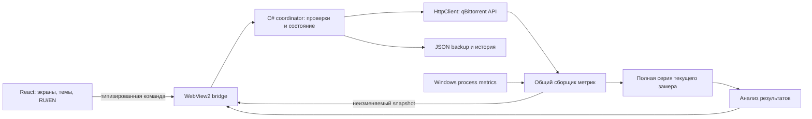

# qFrey-Tuner v2: исполнимый план миграции

Дата: 2026-10-05. Статус: спецификация для будущей реализации; не готовое приложение.
Зафиксированный исходный commit: `398095c13f334a91cc351e7fa62d5ceaab92e7ef`, ветка `windows`, версия `0.3.4`.
Целевая ветка: `codex/dotnet-webview2` — создать при начале реализации. Не считать текущие документы выпуском или основанием для повышения версии.

## 1. Ответ о выполнимости

Да, доступных инструментов достаточно для написания, сборки после подготовки SDK, автоматических тестов и проверки Windows UI. Полностью готовой среды C# сейчас нет: установлен runtime, но `dotnet --list-sdks` не вернул SDK. Это конкретная подготовительная задача, а не необходимость менять стек.

| Проверено на этой машине | Результат | Что это доказывает / не доказывает |
| --- | --- | --- |
| PowerShell, Git, чтение/запись проекта | Доступны | Можно реализовать код и вести изменения |
| `dotnet --list-sdks` | Пусто | Перед компиляцией нужен .NET 10 SDK |
| `dotnet --list-runtimes` | В том числе .NETCore и WindowsDesktop 10.0.11 | Runtime есть; SDK и успешную WPF-сборку это не доказывает |
| `node --version` | 24.19.0 | JS runtime доступен |
| bundled pnpm | 11.19.0 | Менеджер пакетов запускается; npm в PATH не найден |
| локальный uv | 0.12.23 | Запускается из `.cache/tools/uv/Scripts/uv.exe` |
| `uv sync --locked --extra dev` | Успешно, проверены 24 установленных пакета | Python-эталон воспроизводимо доступен |
| WebView2 Application directory | Есть версии 152.0.4191.66 и 154.0.4258.53 | Файлы runtime присутствуют; выбор runtime и Initialize проверить на shell-прототипе |
| Playwright / playwright-core | Найдены в bundled node_modules | Инструмент доступен; тесты будущего WebView2 ещё не выполнены |
| Windows Computer Use | `@oai/sky` импортирован, list_apps выполнен | Можно обнаруживать приложения; будущие окна ещё не проверялись |
| Python pytest | **137 passed in 7.53s** | Текущая версия проходит существующие проверки |
| schema checker | 5 тегов × 2 ветки LT, 31/29 preference keys | Контракт текущего Python-адаптера прошёл source check |

Первый pytest внутри sandbox получил отказ очистки своей `.cache/tests`; первый сетевой checker получил WinError 10013. После разрешённого запуска вне sandbox обе команды прошли. Это ограничения исполнения, не обнаруженные регрессии приложения. Переносимость сборки на чистую Windows, отсутствующий WebView2, живой NAS и реальные ускорения пока не проверены.

Средства можно подготовить локально в `.cache/tools`: .NET SDK, пакеты и тестовые зависимости. Сетевые загрузки зависят от разрешений среды. На этапе планирования ничего не устанавливалось, qBittorrent не изменялся, текущий EXE не заменялся.

## 2. Как читать пакет

| Документ | Кому нужен | Что фиксирует |
| --- | --- | --- |
| [Этот план](README.md) | Координатор | Scope, архитектуру, этапы, риски, инструменты |
| [Контракты и live-метрики](contracts-and-metrics.md) | Backend, bridge, frontend | Типы, состояния, команды, источники метрик, конкурентность |
| [UX, темы и локализация](ux-and-localization.md) | Frontend, дизайн, QA | Экраны, карточки, навигацию, цвета, RU/EN, ошибки |
| [Задачи субагентам](agent-work-packages.md) | Координатор и исполнители | Очерёдность, владение файлами, приёмку и шаблон задания |
| [План проверок](verification.md) | Все исполнители, финальный reviewer | Матрицу тестов, baseline, fault injection, release gates |

Приоритет: явные требования пользователя → AGENTS.md → этот пакет → первоначальная оценка. Любое расхождение контракта исправляет владелец контракта до параллельной реализации, а не каждый агент по-своему.

## 3. Обязательный scope первого полноценного выпуска

1. Полный перенос текущих функций в C# и новый frontend; Python остаётся только инструментом разработки/сборки и эталоном на период переноса.
2. Live-панель: download/upload, peers/seeds, DHT и статус связи, фазы эксперимента, возраст данных; локальные CPU/RAM/I/O процесса qBittorrent, когда процесс однозначно доступен.
3. Тёмная, светлая и системная тема. Полные русский и английский интерфейсы, включая ошибки, статусы, диалоги и отчёты; переключение без перезапуска.
4. Понятный guided flow и свободный просмотр разделов во время работы; редактирование черновика не изменяет выполняемый эксперимент.
5. Типизированные карточки рекомендаций/наблюдений/ошибок/результатов. Отдельные категории: скорость, стабильность, разгон, соединения, ресурсы, конфигурация и ограничения.
6. Конкурентный backend: асинхронный HTTP и файлы, фоновые Windows-вызовы/вычисления, ограниченные очереди, отмена и единый порядок мутаций.
7. Расширенный режим: отключение отдельных рекомендаций и ручное значение в проверенных пределах; повторная проверка нового плана обязательна.
8. История циклов, экспорт JSON и читаемого HTML-отчёта, восстановление старых backup без их разрушения.
9. Обязательные защитные свойства текущего приложения: version gate, schema/type checks, baseline, backup-before-write, readback, rollback, владение test workload, отсутствие секретов в persisted data.
10. Прежний контракт локальной сборки/архивов/двух release assets и отсутствие автоматической публикации.

Не включать в этот перенос облако, учётные записи, AI-советника, Windows Service, базу данных, плагины, auto-tuning без пользователя и поддержку новых qBittorrent minor branches. Точный мониторинг latency диска, bufferbloat, reachability и VPN leak требует отдельных измерителей; показывать их как недоступные, не подменять похожими числами.

## 4. Принятые технические решения

| Область | Решение | Причина |
| --- | --- | --- |
| Desktop | WPF, .NET 10 LTS, один WebView2 | Небольшая оболочка, окна/диалоги/Windows API |
| Frontend | React + TypeScript strict + Vite + Tailwind | При расширенном scope дешевле использовать стандартные компоненты, чем писать собственный DOM/state framework |
| State UI | useReducer/useState и небольшой context | Хранит только представление, черновик и backend snapshots; отдельный Redux пока не нужен |
| Навигация | Типизированный screen id | Шесть локальных разделов, без внешнего router |
| Backend | Core + Desktop, один test project | Нет отдельных сервисов/репозиториев на каждый класс |
| HTTP/JSON | HttpClient, System.Text.Json | Стандартная библиотека |
| Concurrency | async/await, CancellationToken, SemaphoreSlim, ограниченная доставка телеметрии | Не создавать по потоку на карточку или запрос |
| Persistence | Версионированные JSON + атомарное сохранение | Существующие объёмы не требуют SQL |
| i18n | Типизированные словари RU/EN, Intl | Две локали, структурированные сообщения, без ручной конкатенации предложений |
| Graphs | SVG для ограниченной истории | Нет потребности в тяжёлой chart-библиотеке на этом объёме |
| Тесты | xUnit для C#, Vitest для чистой TS-логики, Playwright для web/WebView2 | Достаточно стандартных проверяемых инструментов; не вводить два runner одного назначения |
| Пакеты | pnpm lock + NuGet lock + global.json + uv.lock | Зафиксировать конкретные версии в подготовительной задаче |
| Поставка | self-contained win-x64 EXE + manifest; Evergreen WebView2 prerequisite | Гипотезу single-file подтвердить до основного переноса |

Изменение относительно первого плана: React выбран из-за live-виджетов, двух языков, тем, истории и нескольких пересекающихся состояний. Это решение для нового scope, а не требование Tailwind/WebView2. Полный Windows chrome остаётся стандартным WPF: не тратить первую итерацию на собственную title bar, drag regions и resize.

## 5. Структура исходников после реализации

```text
src/
  QFrey.Core/
    Contracts/       # DTO, статусы, команды и ошибки
    Qbittorrent/     # API и compatibility
    Tuning/          # calculator, plan, coordinator
    Metrics/         # collection, analysis, snapshots
    Workloads/       # catalogue, metadata, ownership
    Persistence/     # cycle/setup storage и legacy import
  QFrey.Desktop/
    Bridge/         # origin, dispatcher, JSON boundary
    Platform/       # Windows discovery, process lifecycle, local metrics
    App.xaml / MainWindow.xaml
frontend/
  src/
    bridge/ contracts/ state/
    components/ screens/ charts/
    i18n/ styles/
  tests/
tests-dotnet/QFrey.Tests/
tests-contract/fixtures/
tests-e2e/
docs/migration-v2/
scripts/build.py     # единственная точка упаковки
```

Папка не означает отдельный проект/слой. Не создавать пустые файлы для всего дерева. Добавлять модуль только в задаче, которая его реализует. Существующие optimizer/ui/tests сохранить до доказанного паритета; удаление Python runtime-кода — отдельная завершающая задача, а не первый commit.

## 6. Основной поток



Ни C# domain, ни алгоритмы оптимизации не находятся в JavaScript. Frontend не обращается к qBittorrent напрямую и не знает cookies. Backend разрешает операции; UI объясняет решения backend. Представление работает с имитацией bridge для тестов, но сборка выпуска не включает возможность подменить реальный backend произвольным URL.

## 7. Этапы и gates

| Этап | Выход | Gate |
| --- | --- | --- |
| G0 Эталон и инструменты | Закреплённый SHA, SDK, lockfiles, результаты текущих проверок | Тесты и source checker проходят; сборка shell технически возможна |
| G1 Контракты и оболочка | Локальный React в WebView2, Hello/Initialize bridge, темы/RU/EN skeleton | Ранняя проверка single-file, real WebView2, offline assets, отсутствующего runtime |
| G2 Read-only | Connect, gate, данные, calculator, live metrics | Числовой паритет, корректные unknown/stale, отсутствие мутаций |
| G3 Безопасные операции | Apply, rollback, recovery, workload и measurement | Fault injection и stale/duplicate commands безопасны |
| G4 Полный продукт | Все экраны, категории, история, advanced selection, RU/EN | Сценарии UI и матрица локалей/тем/масштабов пройдены |
| G5 Кандидат | Локальные тесты, чистый ПК/VM, измерения, packaged checks | Только теперь замена текущего локального EXE с архивом |

На G1 остановить расширение функциональности, если упаковка не соответствует EXE + manifest. Решить loader/web asset extraction/runtime prerequisite, обновить build-layout-design.md. Не прятать проблему выпуском случайной ZIP-папки или вторым EXE в другом каталоге.

## 8. Границы ответственности субагентов

Координатор владеет контрактами, зависимостями, сборкой и финальным gate. Экономичный исполнитель получает одну небольшую задачу с уже фиксированным поведением. Одновременно: координатор + максимум три исполнителя. Общие DTO, package.json/lockfiles, build.py и словари не редактируются несколькими агентами одновременно.

Более сильный reviewer проверяет unsafe boundaries: авторизацию, JSON bridge, backup/apply/rollback, конкурентность, процессное владение, парсер метаданных и публикацию. Стоимость снижается разделением труда и коротким контекстом, а не отказом от этих проверок. Конкретную модель и цену выбирать при запуске по доступности пользователя; здесь нет обещания тарифов и автоматического выбора модели.

## 9. Оценка объёма

Расширенные требования увеличивают объём относительно первого плана. Рабочий ориентир: 35–55 человеко-дней на реализацию, интеграцию и QA; это не календарная гарантия и не стоимость токенов. Один координатор с несколькими агентами может ускорить независимые экраны/тестовые данные, но этапы контрактов, unsafe review и реального Windows QA остаются последовательными.

Пересмотреть оценку после G1 и G3. Самые неопределённые части: single-file WebView2, Windows owner/process metadata, legacy recovery, и масштабирование telemetry при тысячах торрентов. Не оценивать миграцию как простой перевод 3 тысяч строк Python.

## 10. Что считается завершением

Все обязательные требования имеют тест или ручное доказательство; нет незакрытых критических ошибок потери данных/неверного применения. Оба языка и темы работают в настоящем EXE, live данные соответствуют источнику, UI остаётся отзывчивым, история переживает перезапуск, backend не допускает конфликтующих мутаций. Проверки и ограничения перечислены честно: API readback не доказывает ускорение или защиту VPN.

Публикация в GitHub не входит в этот план как автоматическое действие. Build/release выполняются только по существующему контракту проекта; новый тег и загрузка assets — после явного запроса пользователя.
